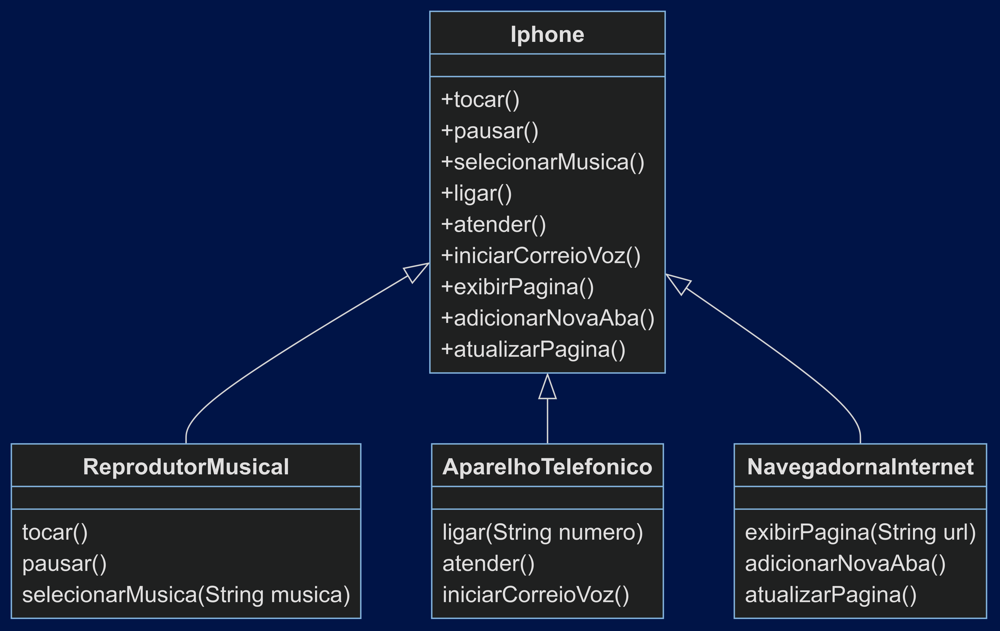

# Projeto iPhone

Este projeto modela um iPhone com as funcionalidades de Reprodutor Musical, Aparelho Telefônico e Navegador na Internet usando interfaces Java.

## Desafio

Modelagem e diagramação da representação em UML e código no que se refere ao componente iPhone.

## Diagrama UML

## Descrição das Funcionalidades

### Reprodutor Musical
- `tocar()`: Inicia a reprodução de uma música.
- `pausar()`: Pausa a música em reprodução.
- `selecionarMusica(String musica)`: Seleciona uma música para reproduzir.

### Aparelho Telefônico
- `ligar(String numero)`: Liga para o número fornecido.
- `atender()`: Atende uma chamada recebida.
- `iniciarCorreioVoz()`: Inicia o correio de voz.

### Navegador na Internet
- `exibirPagina(String url)`: Exibe a página web fornecida.
- `adicionarNovaAba()`: Adiciona uma nova aba no navegador.
- `atualizarPagina()`: Atualiza a página atual no navegador.
